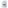

<h1 align="center">
    <!-- https://raw.githubusercontent.com/greg904/costau/master/images/logo.svg -->
    
    <br>
    CosTau
    <br>
</h1>

<h4 align="center">A WIP calculator that tries to give you exact results
when possible</h4>

<p align="center">
    <a href="https://travis-ci.org/greg904/costau">
        
    </a>
    <a href="https://opensource.org/licenses/MIT">
        
    </a>
</p>


## How to build

To build the application, you will need Visual Studio and rustup.

In order to build the Rust part of the project, we will use a special Rust
target that supports the UWP ABI and APIs.

The name of the target is `<arch>-uwp-windows-msvc` where `<arch>` is `i686`,
`x86_64` or `aarch64` depending on the architecture that you are building the
project for.

Fortunately, this target is supported by the Rust compiler in the toolchain that
we're using (see the `rust-toolchain` file).

However, the `rust-std` component for the target is not precompiled and needs to
be built manually. Fortunately, we can use Xargo to automatically build it.

Once you have installed rustup, cloned the repository locally and navigated to
it with your shell, run the following command to install Xargo:

```pwsh
cargo install xargo
```

Now, make sure that Visual Studio with UWP development support is installed and
open the `costau/CosTau.sln` solution file with Visual Studio. From there you should
be able to build and run the application.